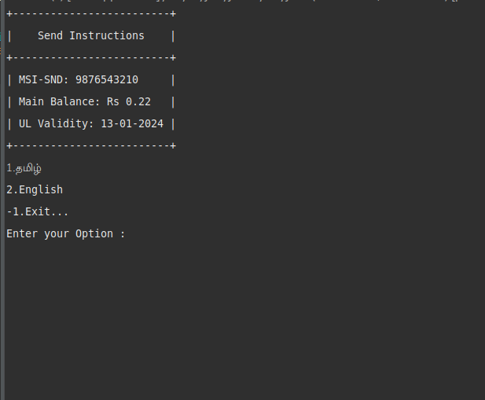
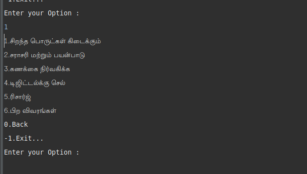
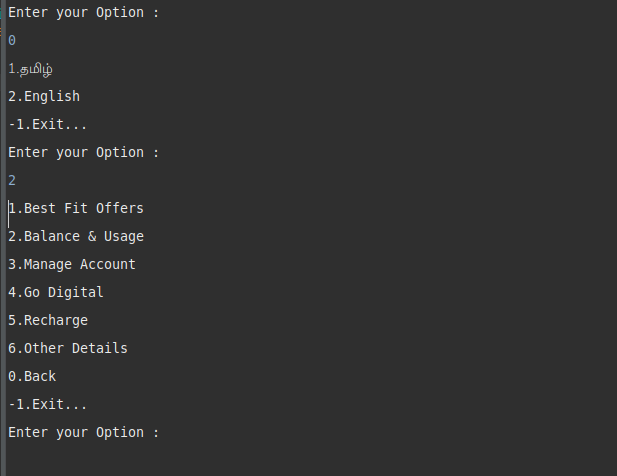
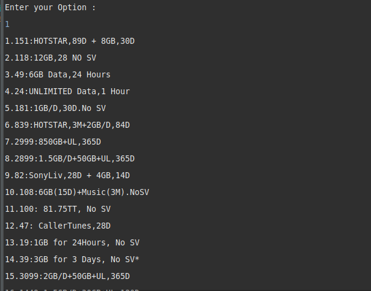
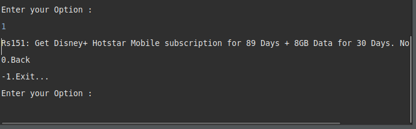

# ChatBot Documentation

## Table of Contents

1. Introduction
2. Features
3. Components
    * ChatBot
    * ChatBotView
    * ChatBotViewModel
    * ChatBotRepository
4. Implementation Details
5. Usage
6. Contributors
8. Class Diagram
7. Preview

## Introduction

The ChatBot is a console-based application developed in __Java__. It serves as a simple chatbot allowing users to navigate through a set of predefined messages, providing information or options based on user input.

## Features

1. __Interactive Chat:__ Users can navigate through a set of predefined messages.

2. __Dynamic Options:__ Users can choose options presented in the chat to navigate further.

3. __Error Handling:__ The application provides basic error handling for incorrect inputs.

4. __Introduction Display:__ Displays an introduction with initial information.

## Components

### ChatBot

 * The main class containing the __main__ method.

 * Creates and starts an instance of __ChatBotView__.

### ChatBotView

* Manages the user interface for the chatbot.

* Handles user input and interacts with the ChatBotViewModel.

* Displays an introduction and chat messages.

### ChatBotViewModel

* Acts as an intermediary between the view and the repository.

* Processes user input, adds, removes, and displays chat messages.

* Handles user input validation.

### ChatBotRepository

* Manages the storage and retrieval of chat data.

* Uses a stack (backStack) to keep track of user navigation.

* Parses JSON data from a file.

## Implementation Details

1. The application is Java-based, utilizing a simple MVVM-like pattern.

2. Basic error handling is implemented for user input.

3. Uses a stack for tracking the user's navigation through chat messages.

4. Displays an introduction with initial information.

## Contributors
> ___M.Elangovan___

## Class Diagram
```
+-----------------------+         +--------------------------+       +-------------------------+        +----------------------------+
|      ChatBot          |         |      ChatBotView         |       |   ChatBotViewModel      |        |   ChatBotRepository        |
+-----------------------+         +--------------------------+       +-------------------------+        +----------------------------+
|                       |         | - chatBotViewModel:      |       | - chatBotView:          |        | - backStack: Stack<String> |
|                       |         |   ChatBotViewModel       |       |   ChatBotView           |        |                            |
| + main(String[])      |         | - start()                |       | - addChat(String)       |        | + getInstance():           |
+-----------------------+         | - introduction()         |       | - addChatWithCurrentChat|        |   ChatBotRepository        |
                                  | - displayChat(JSONArray) |       | - getCurrentChat()      |        |                            |
                                  | - showErr(String)        |       | - removeCurrentChat()   |        | - addToStack(String)       |
                                  +--------------------------+       | - displayCurrentChat()  |        | - getCurrentPath()         |
                                                                     | - getInt()              |        | - parse(String): JSONArray |
                                                                     +-------------------------+        | - removeCurrentChat()      |
                                                                                                        +----------------------------+

+----------------------------------+
|      Recipe                      |
+----------------------------------+
| - recipeId: int                  |
| - recipeName: String             |
| - ingredients: List<Ingredient>  |
| - instructions: List<String>     |
+----------------------------------+
| + constructors, getters, setters |
+----------------------------------+

+-----------------------------------+
|    Ingredient                     |
+-----------------------------------+
| - ingredientName: String          |
| - quantity: double                |
| - unit: String                    |
+-----------------------------------+
| + constructors, getters, setters  |
+-----------------------------------+

+--------------------------------+
| RecipeBookManager              |
+--------------------------------+
| - recipes: List<Recipe>        |
+--------------------------------+
| + addRecipe(Recipe)            |
| + removeRecipe(int)            |
| + viewRecipes()                |
| + findRecipeById(int): Recipe  |
+--------------------------------+

+---------------------+
|      MainApp        |
+---------------------+
| + main(String[])    |
+---------------------+

```
## Preview


---

---

---

---

---
